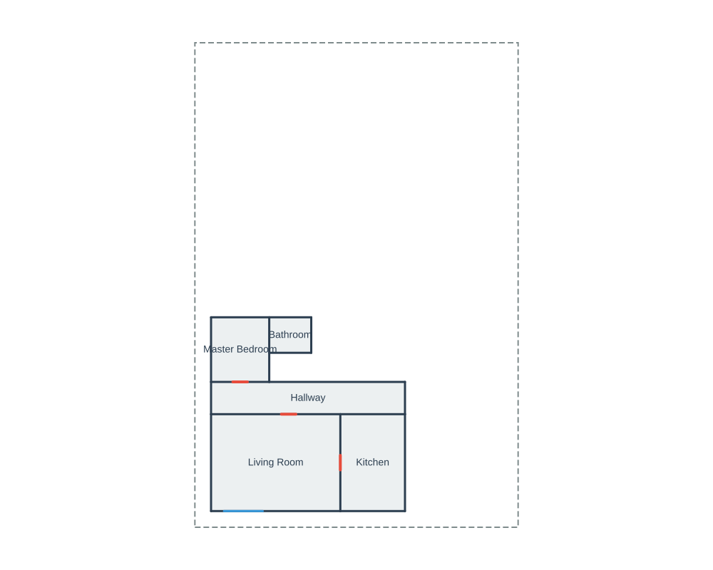

# PlanScript

PlanScript is a deterministic, textual DSL for defining 2D architectural floor plans. Write human-readable code and compile it with the Rust implementation into precise SVG and JSON geometry.

The canonical product lives in [`planscript-rust`](planscript-rust/). The repository is Rust-only for compiler, solver, catalog, validation, and export work.

<p align="center">
  
</p>

## Features

- Human and LLM friendly syntax with a small, repetitive vocabulary
- Deterministic compiler pipeline: parse -> lower -> geometry -> validate -> export
- Precise room, wall, door, window, and fixture geometry
- Indoor floor materials, outdoor areas, SVG hatches, and auto floor legends
- Color and black-and-white architectural draft SVG rendering modes
- Built-in fixture catalog for common residential items
- External `.psobj.json` catalog support and IFC import normalization
- Intent solver for generating PlanScript from higher-level JSON requests
- SVG and JSON exports, including layout warnings that do not block rendering

## Example

```planscript
units m
defaults {
  door_width 0.9
  window_width 2.4
}

plan "Example House" {
  footprint rect (0,0) (20,30)

  room living {
    rect (1,1) (9,7)
    label "Living Room"
  }

  room kitchen {
    rect size (4,6)
    attach east_of living
    align top
    gap 0
    label "Kitchen"
  }

  room hall {
    rect span x from living.left to kitchen.right y (7, 9)
    label "Hallway"
  }

  opening door d1 {
    between living and hall
    on shared_edge
    at 60%
    swing rh
  }

  opening window w1 {
    on living.edge south
    at 2.0
    width 1.5
  }

  assert no_overlap rooms
  assert inside footprint all_rooms
}
```

## Rust CLI

Build or run the Rust CLI through Cargo:

```bash
cargo run --manifest-path planscript-rust/Cargo.toml -- compile examples/house.psc --svg /tmp/house.svg
cargo run --manifest-path planscript-rust/Cargo.toml -- compile examples/house.psc --svg /tmp/house.svg --json /tmp/house.json --dimensions
cargo run --manifest-path planscript-rust/Cargo.toml -- solve examples/simple-house.intent.json --out /tmp/simple-house.psc --svg /tmp/simple-house.svg
```

Catalog tools:

```bash
cargo run --manifest-path planscript-rust/Cargo.toml -- catalog list
cargo run --manifest-path planscript-rust/Cargo.toml -- catalog show builtin.sanitary.toilet.floor_mounted
cargo run --manifest-path planscript-rust/Cargo.toml -- catalog import-ifc planscript-rust/examples/ifc/minimal-toilet.ifc --id sample.toilet --category sanitary --out /tmp/catalog
cargo run --manifest-path planscript-rust/Cargo.toml -- catalog lint /tmp/catalog
```

## Rust Library

```rust
use planscript::compiler::{compile, CompileOptions};

let source = r#"
units m
plan "My House" {
  footprint rect (0,0) (10,8)
  room living { rect (0,0) (10,8) label "Living Room" }
}
"#;

let result = compile(source, CompileOptions::default());
if result.success {
    println!("{}", result.svg.unwrap_or_default());
    for warning in result.warnings {
        println!("warning: {warning}");
    }
} else {
    eprintln!("{:?}", result.errors);
}
```

The public Rust crate exposes the full pipeline:

- `parse`
- `lower`
- `generate_geometry`
- `validate`
- `export_svg`
- `export_json`
- `compile`
- `solve`

## Fixtures and BIM Objects

PlanScript includes built-in fixture objects for common residential items such as toilets, sinks, showers, counters, refrigerators, cooktops, ranges, doors, and windows. Object catalog entries can also be imported from IFC into normalized `.psobj.json` files for curated BIM-backed libraries.

```planscript
object wc1 {
  use builtin.sanitary.toilet.floor_mounted
  in bath
  attach west wall
  at 0.8
  facing east
}
```

See [`planscript-rust/CATALOG.md`](planscript-rust/CATALOG.md) for catalog and IFC workflows.

## Floor Materials and Outdoor Areas

Rooms and outdoor areas can declare floor materials. SVG output uses matching hatches/patterns and renders a floor-material legend only when declared materials are present.

```planscript
defaults {
  floor hardwood
  outdoor_floor pavers
}

plan "Deck and Patio" {
  footprint rect (0,0) (12,8)
  legend { floor_materials auto }

  room living {
    rect (0,0) (12,8)
    floor tile
  }

  outdoor deck rear_deck {
    rect (0,8) (8,12)
    floor wood_deck
    label "Rear Deck"
  }
}
```

For black-and-white architectural draft output, use a global render block or the CLI flag:

```planscript
render {
  mode draft
}
```

```bash
cargo run --manifest-path planscript-rust/Cargo.toml -- compile planscript-rust/examples/outdoor-floor-materials.psc --svg /tmp/floors-draft.svg --draft
```

For detailed construction-style annotations, use a `dimensions` block or CLI flags:

```planscript
dimensions {
  walls all
  fixtures all
}
```

```bash
cargo run --manifest-path planscript-rust/Cargo.toml -- compile planscript-rust/examples/dimension-controls.psc --svg /tmp/dimensions.svg --dimensions all
```

## Examples

Regenerate all example SVGs with the Rust CLI:

```bash
./scripts/build-examples-psc.sh
```

This writes color output as `<name>.svg`, draft output as `<name>_draft.svg`, and warning captures as `<name>_warnings.txt` / `<name>_draft_warnings.txt`.

Regenerate intent-based examples:

```bash
./scripts/build-examples-intent.sh
```

Warnings emitted during example compilation are written beside each generated SVG.

## Documentation

- [`LANGUAGE_REFERENCE.md`](LANGUAGE_REFERENCE.md) - complete PlanScript syntax
- [`INTENT_REFERENCE.md`](INTENT_REFERENCE.md) - solver intent JSON format
- [`planscript-rust/README.md`](planscript-rust/README.md) - Rust crate details
- [`planscript-rust/CATALOG.md`](planscript-rust/CATALOG.md) - object catalog and IFC import workflow

## Testing

```bash
cargo test --manifest-path planscript-rust/Cargo.toml
```

## License

MIT
